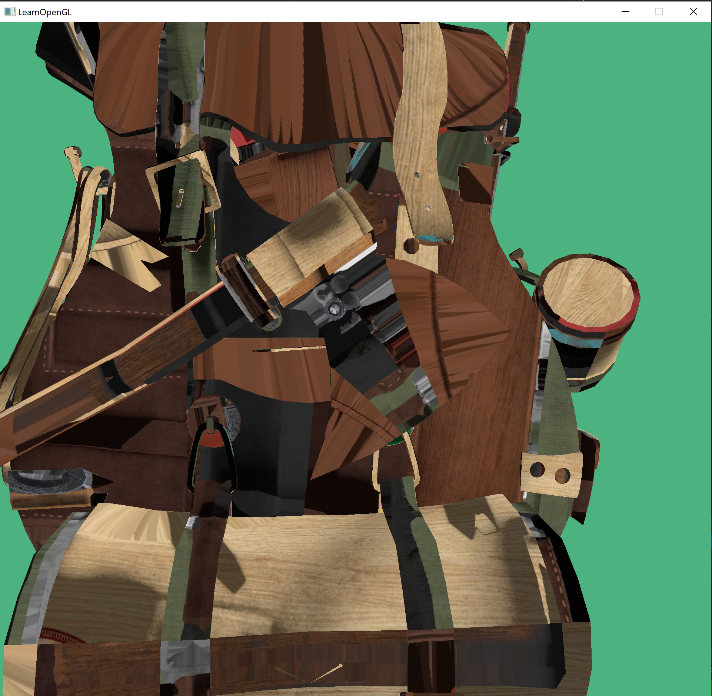
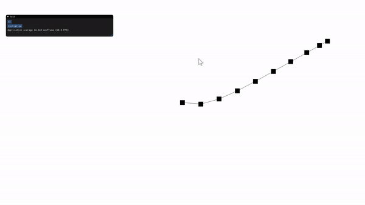

# OpenGL-Learning
This a repo of my learning OpenGL.

## Current progress

##### Framework for simple Shader-Toy

##### 3D Model Load

##### Rope Simulator using Mass-Spring System method (semi-implicit time integration)

 